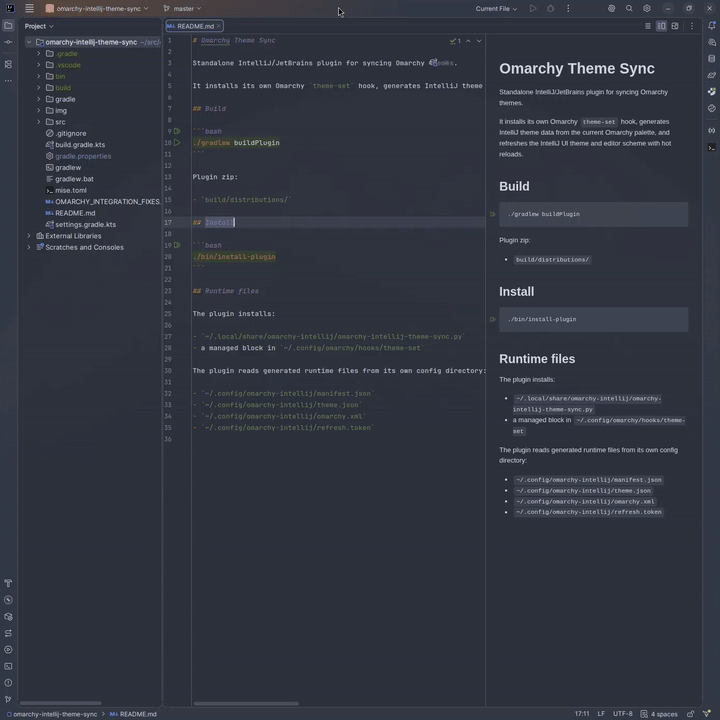

# Omarchy Theme Sync



JetBrains IDE plugin for syncing [Omarchy](https://github.com/basecamp/omarchy) themes.

It installs its own Omarchy `theme-set` hook, generates IntelliJ theme data from the current Omarchy palette, and refreshes the IntelliJ UI theme and editor scheme with hot reloads.

## Build

```bash
./gradlew buildPlugin
```

Plugin zip:

- `build/distributions/`

## Install

For normal use, install the plugin from JetBrains Marketplace once it is published.

For local testing, build the plugin and install the generated ZIP from disk via the IDE:

```bash
./gradlew buildPlugin
```

Then open `Settings | Plugins | ⚙ | Install Plugin from Disk...` and select the ZIP from `build/distributions/`.

## Runtime files

The plugin installs:

- `~/.local/share/omarchy-intellij/omarchy-intellij-theme-sync.py`
- a managed block in `~/.config/omarchy/hooks/theme-set`

The plugin reads generated runtime files from its own config directory:

- `~/.config/omarchy-intellij/manifest.json`
- `~/.config/omarchy-intellij/theme.json`
- `~/.config/omarchy-intellij/omarchy.xml`
- `~/.config/omarchy-intellij/refresh.token`
