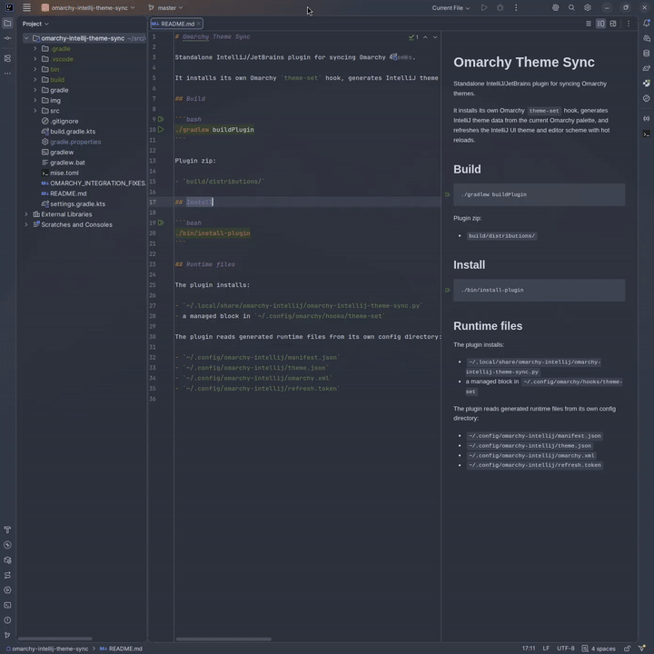

# Omarchy IntelliJ Theme Sync



Syncs the active Omarchy theme to IntelliJ IDEA and other JetBrains IDEs.

The Omarchy plugin installs a `theme-set` hook and manages a small JetBrains bridge. The hook generates the current UI theme and editor scheme; the bridge applies them to running IDEs.

## Install

```bash
omarchy plugin add https://github.com/fchtngr/intellij-omarchy-theme-sync.git --enable
```

Restart each detected JetBrains IDE once after installation. Later Omarchy theme changes are applied without restarting.

The bridge supports JetBrains IDEs from 2024.1 onward installed in the standard Linux user data directory.

## Update

```bash
omarchy plugin update fchtngr.intellij-theme-sync
```

Restart JetBrains IDEs only when the bridge itself was updated.

## Uninstall

Run the cleanup before removing the Omarchy plugin:

```bash
~/.config/omarchy/plugins/fchtngr.intellij-theme-sync/install.sh --uninstall
omarchy plugin remove fchtngr.intellij-theme-sync
```

## Development

```bash
omarchy plugin validate .
./test/install-test.sh
./gradlew verifyPlugin
```

Tags named `v<version>` publish the bridge archive consumed by the matching `manifest.json` version.
